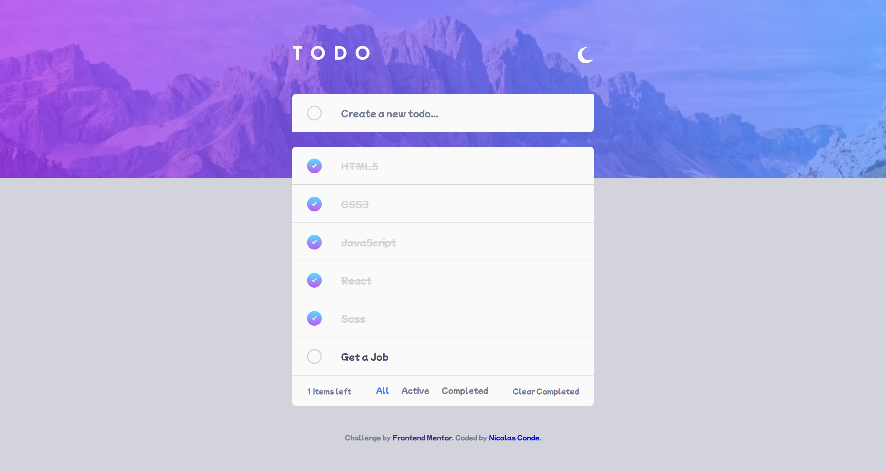

# Todo App

This app was built in React, implementing the basic hooks, and styles in Sass, the user can create and delete todos, filter by state, etc. App with color theme toggle.

## Table of contents

- [Overview](#overview)
  - [The project](#the-project)
  - [Screenshot](#screenshot)
  - [Links](#links)
- [My process](#my-process)
  - [Built with](#built-with)
  - [What I learned](#what-i-learned)
  - [Useful resources](#useful-resources)
- [Author](#author)

## Overview

### The project

Users should be able to:

- See the todos
- Create a new todo
- Delete a existing todo
- Filter by status
- Clear todos completed
- Toggle the theme color

### Screenshot

### Links

- Solution URL: [Solution URL here](https://github.com/ncondes/todo-app)
- Live Site URL: [Live site URL here](https://gallant-aryabhata-022705.netlify.app/)

## My process

### Built with

- Semantic HTML5 markup
- CSS custom properties
- Flexbox
- CSS Grid
- Mobile-first workflow
- Sass
- [React](https://reactjs.org/) - JS library

### What I learned and put into practice

- Make the layout ( structure and styles ) of the app
- Use of the React hooks
- Styles with Sass 
- Input fields
- Filters and some other JS functions

### Useful resources

- [React](https://reactjs.org/) - Documentation of the library React.js
- [Sass](https://sass-lang.com/) - Documentation of Sass

## Author

- Website - [Nicolas Conde Salazar](https://www.ncondes.com)
- Linkedin - [Nicolas Conde Salazar](https://www.linkedin.com/in/ncondes/)